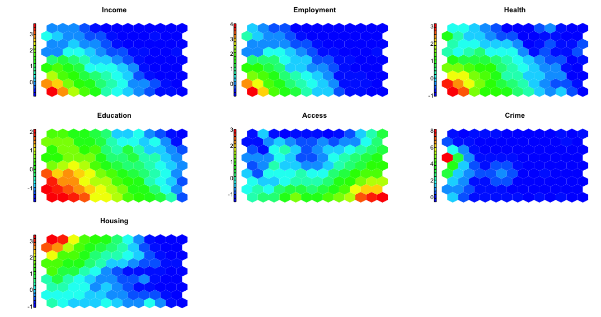
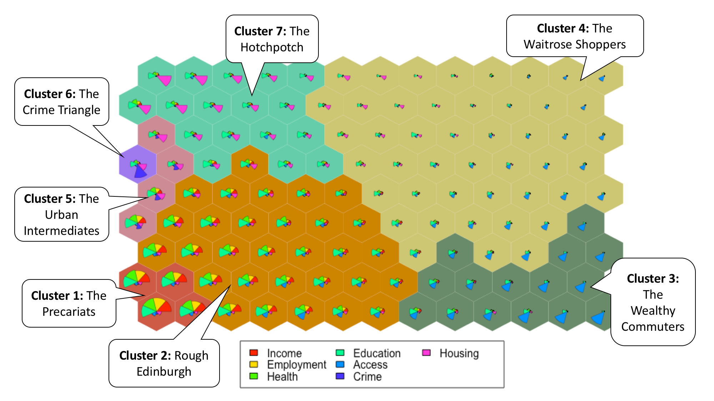
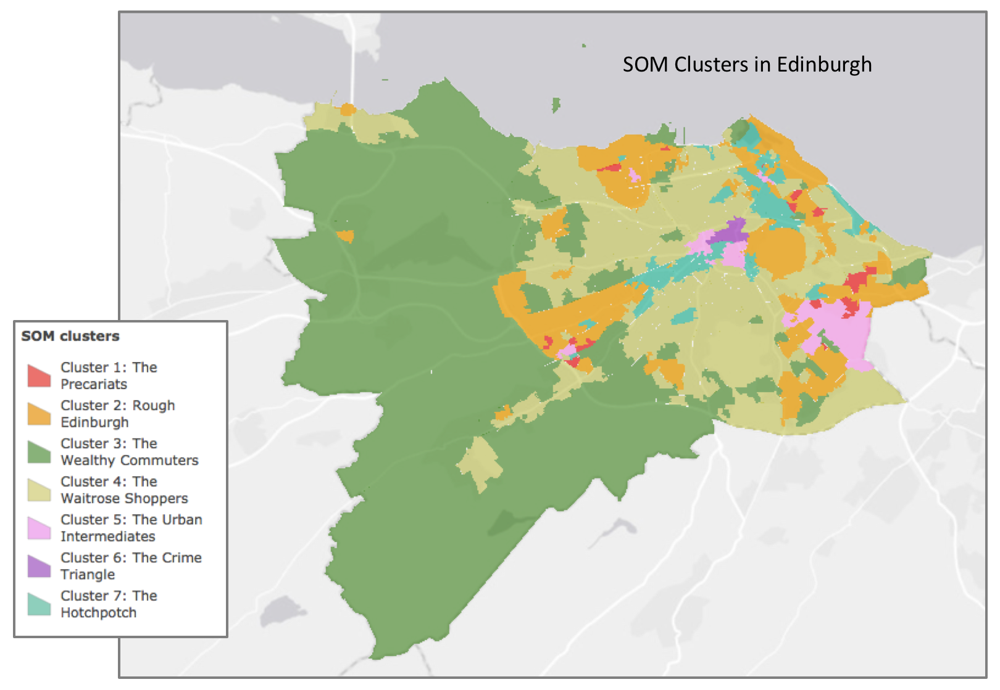

# Self-Organising Maps: Using Machine Learning to Explore Spatial Data

This project applies the SOM technique to Scottish deprivation data from Edinburgh. Seven clusters (hierachical clustering) are created and displayed on a geographical map.

Read more: http://www.geo-blog.com/soms-for-geographical-data/

## What are SOMs?
Self-Organising Maps (SOMs) are a type of unsupervised Artificial Neural Networks (ANNs). They were developed by Teuvo Kohonen (1982) and are mostly used for clustering, visualisation and data exploration. SOMs reduce n-dimensional data and display it on the two-dimensional map where similar data is placed into the same grid cells.

## Content
- *data* – This folder contains input data and metadata; Scottish Index of Multiple Deprivation (SIMD) data in Edinburgh on Scottish datazone level
- *code* – The SOM technique is applied using the "kohonen" package with R, for more information see comments within the code
- *output_graphics* – This folder contains all graphics and output maps
- *output_shapefile* – This folder contains a shapefile of the geographical maps with the seven clusters; the folder is created within the R script

## Output
For descriptions of the output read the following blog post: http://www.geo-blog.com/soms-for-geographical-data/

